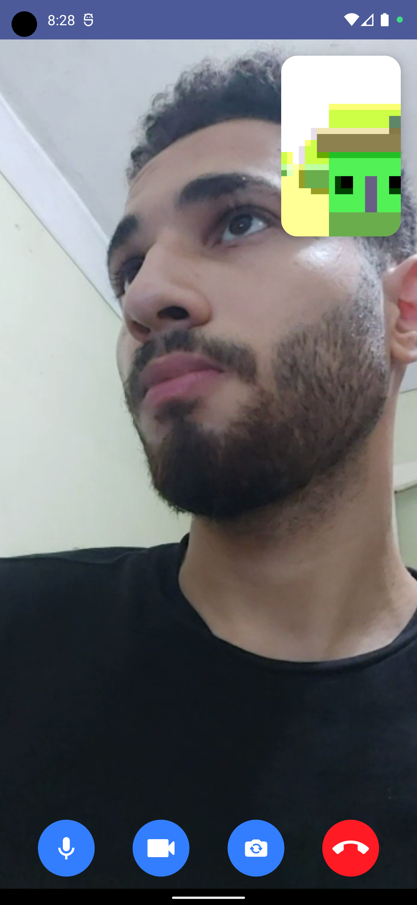

# Connectly

This project demonstrates [WebRTC protocol](https://getstream.io/glossary/webrtc-protocol/) to facilitate real-time video communications with Jetpack Compose.

The purpose of this repository is to demonstrate below:
- Implementing entire UI elements for real-time video communication with Jetpack Compose.
- Performing real-time communication in background with Kotlin Coroutines.
- Understanding the peer connection based on WebRTC.
- Communicating with a signaling server to exchange peer connection information between clients.

## 📷 Previews

<p align="center">


</p>

## 🛠 Tech Stacks & Open Source Libraries
- Minimum SDK level 23.
- 100% [Jetpack Compose](https://developer.android.com/jetpack/compose) based + [Coroutines](https://github.com/Kotlin/kotlinx.coroutines) + [Flow](https://kotlin.github.io/kotlinx.coroutines/kotlinx-coroutines-core/kotlinx.coroutines.flow/) for asynchronous.
- [WebRTC](https://webrtc.org/): To build real-time communication capabilities to your application that works on top of an open standard.
- [Stream WebRTC Android](https://github.com/GetStream/stream-webrtc-android): A WebRTC pre-compiled library for Android reflects the recent WebRTC updates and supports functional UI components and extensions for Android and Jetpack Compose.
- [Retrofit2 & OkHttp3](https://github.com/square/retrofit): Construct the REST APIs and paging network data.
- [StreamLog](https://github.com/GetStream/stream-log): A lightweight and extensible logger library for Kotlin and Android.
- [Ktor](https://github.com/ktorio/ktor): Building a signaling client websocket server.


# License
```xml
Copyright 2023 AmrG, Inc. All Rights Reserved.

Licensed under the Apache License, Version 2.0 (the "License");
you may not use this file except in compliance with the License.
You may obtain a copy of the License at

   http://www.apache.org/licenses/LICENSE-2.0

Unless required by applicable law or agreed to in writing, software
distributed under the License is distributed on an "AS IS" BASIS,
WITHOUT WARRANTIES OR CONDITIONS OF ANY KIND, either express or implied.
See the License for the specific language governing permissions and
limitations under the License.
```
